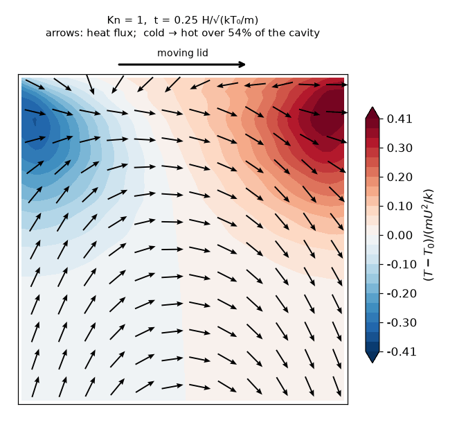
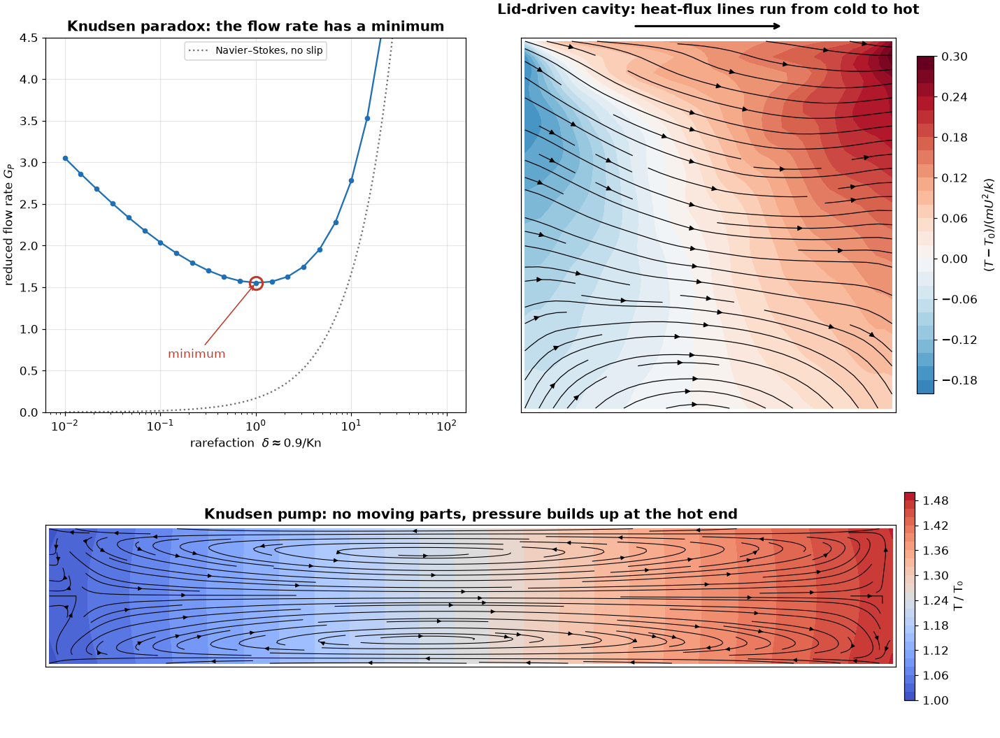
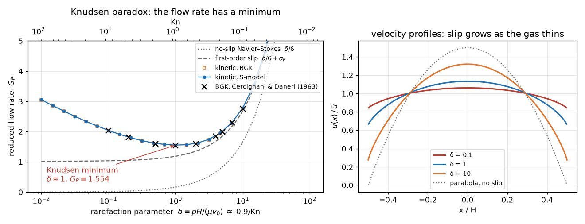
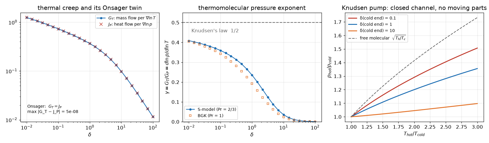
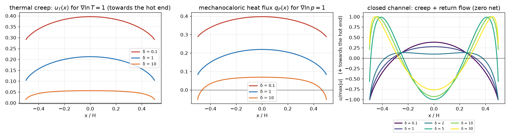
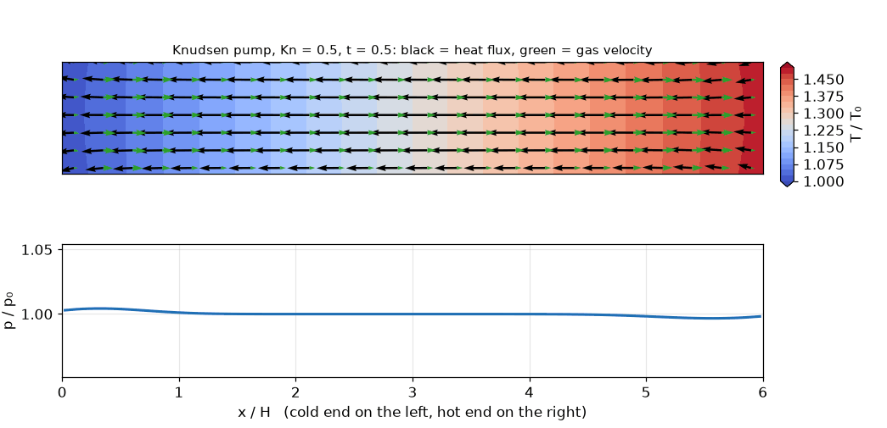
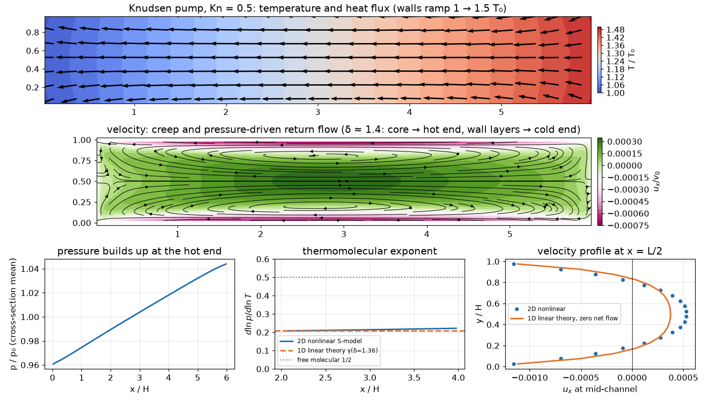
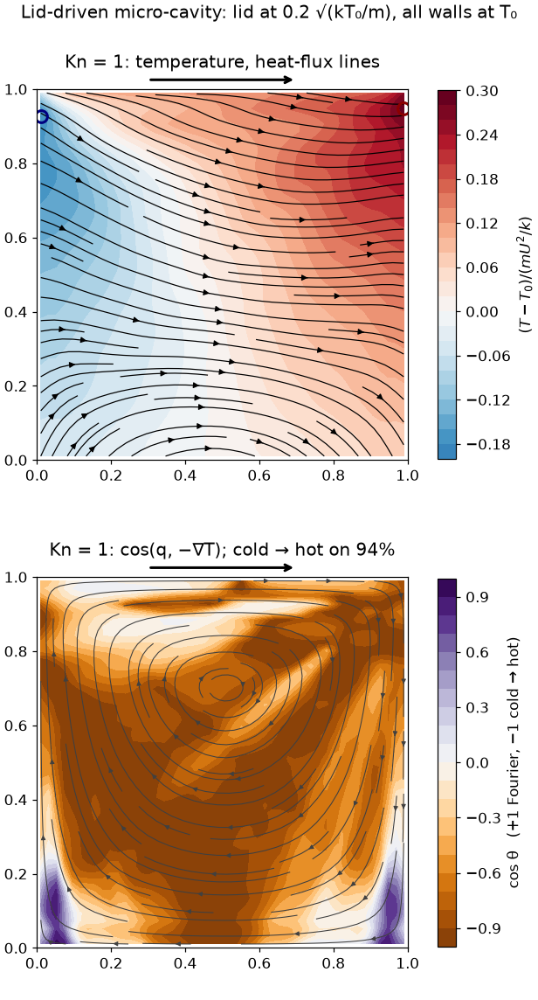

# Three Puzzles of Gas Flow in Micro Devices

[](https://github.com/cfdgasman/rarefied-mems-paradoxes/actions/workflows/ci.yml)

In a micro-channel, a MEMS sensor or a vacuum gap, the gas molecules travel a distance comparable to the device before they collide. Three things then happen that the Navier–Stokes equations cannot explain:

1. **The Knudsen paradox.** As the pressure drops, the dimensionless flow rate through a channel first *falls* and then *rises* again. It has a minimum near Kn ≈ 1.
2. **The Knudsen pump.** Heat one end of a channel and the gas creeps along the walls **from cold to hot**, with no moving parts. A closed channel builds up a pressure difference, p<sub>hot</sub>/p<sub>cold</sub> → √(T<sub>hot</sub>/T<sub>cold</sub>).
3. **Heat flowing from cold to hot.** In a gas stirred by a moving wall, the heat flux points **from the cold region to the hot region**, against Fourier's law.

This repository solves all three with the **Boltzmann kinetic equation** (BGK and Shakhov model collision operators), checks each solver against exact results of kinetic theory, and shows the transient flows as temperature contours with heat-flux vectors.

<p align="center"></p>
<p align="center"><em>A lid starts moving over a gas at rest (Kn = 1). Colours: temperature. Arrows: heat-flux direction. Heat flows from the cold upper-left corner into the hot upper-right corner.</em></p>

<p align="center"></p>

**Contents**: [Kinetic theory in one page](#kinetic-theory-in-one-page) · [1. Knudsen paradox](#1-the-knudsen-paradox) · [2. Knudsen pump](#2-the-knudsen-pump-thermal-transpiration) · [3. Heat from cold to hot](#3-heat-flowing-from-cold-to-hot) · [Validation summary](#validation-summary) · [Usage](#usage) · [References](#references)

---

## Kinetic theory in one page

The gas is described by the velocity distribution f(**x**, **v**, t), the number of molecules per unit volume of position and velocity. It obeys the Boltzmann equation; here the collision integral is replaced by a relaxation model:

$$ \frac{\partial f}{\partial t} + \mathbf v\cdot\nabla_{\mathbf x} f = \nu\,\bigl(f^{\rm S} - f\bigr),\qquad \nu = \frac{p}{\mu(T)},\qquad \mu = \mu_{\rm ref}\,(T/T_0)^{\omega}. $$

* **BGK model:** f<sup>S</sup> is the local Maxwellian f<sup>M</sup>. Simple, but its Prandtl number is 1.
* **Shakhov (S) model:** a heat-flux correction gives the correct Prandtl number of a monatomic gas, Pr = 2/3,

$$ f^{\rm S} = f^{\rm M}\left[1 + \frac{(1-{\rm Pr})\,\mathbf c\cdot\mathbf q}{5\,p\,RT}\left(\frac{c^2}{RT} - 5\right)\right],\qquad \mathbf c = \mathbf v - \mathbf u. $$

The moments give the familiar fields: density n = ∫f d**v**, velocity **u**, temperature (3/2)nkT = ∫½m c² f d**v**, and the heat flux

$$ \mathbf q = \int \tfrac12 m\,c^2\,\mathbf c\, f\, d\mathbf v . $$

Nothing in the kinetic equation says q = −κ∇T. Fourier's law is only the first term of the Chapman–Enskog expansion, valid when collisions are frequent.

**Rarefaction.** Two equivalent measures are used:

$$ \mathrm{Kn} = \frac{\lambda}{H},\qquad \delta = \frac{pH}{\mu v_0},\quad v_0 = \sqrt{2kT/m},\qquad \delta \approx \frac{0.903}{\mathrm{Kn}} $$

with λ the hard-sphere mean free path defined through the viscosity, μ = (5√(2π)/16) ρλ√(kT/m). The gas is argon-like: ω = 0.81 in the 2D runs.

| regime | Kn | δ | what dominates |
|---|---|---|---|
| continuum | < 0.01 | > 100 | collisions; Navier–Stokes with no slip |
| slip | 0.01–0.1 | 10–100 | thin Knudsen layers at the walls |
| transition | 0.1–10 | 0.1–10 | collisions and wall–wall flights compete |
| free molecular | > 10 | < 0.1 | molecules fly from wall to wall |

**Walls** reflect diffusely: a molecule hitting a wall forgets its velocity and is re-emitted with the wall's Maxwellian (wall temperature and velocity), with a density that returns exactly the incoming mass flux.

---

## 1. The Knudsen paradox

### Problem

Gas fills a plane channel −H/2 < x < H/2. A small pressure gradient X<sub>P</sub> = H d ln p / dy drives it along y. In the continuum (no-slip) limit the mass flow rate is the Poiseuille result, which in reduced form reads

$$ G_P = -\frac{\dot M}{H\,p\,X_P/v_0} = \frac{\delta}{6}. $$

It falls linearly with pressure. In free-molecular flow, by contrast, G<sub>P</sub> grows like −ln δ /√π as δ → 0. Molecules flying almost parallel to the walls travel a long way before hitting one. Between the two lies a minimum.

### Linearised kinetic equation

For a small gradient, f = f<sub>0</sub>(1 + h) and h = c<sub>y</sub>Φ(x, c<sub>x</sub>, c<sub>⊥</sub>²). Integrating out the two velocity components along the walls leaves two reduced functions Y(x, c) and Z(x, c) of one velocity c = c<sub>x</sub>/v<sub>0</sub>:

$$ c\,\frac{\partial Y}{\partial x} + \delta Y = \delta\Bigl[u + \tfrac{2}{15}\,a\,q\,\bigl(c^2-\tfrac12\bigr)\Bigr] - \tfrac12\Bigl[X_P + \bigl(c^2-\tfrac12\bigr)X_T\Bigr] $$

$$ c\,\frac{\partial Z}{\partial x} + \delta Z = \delta\Bigl[2u + \tfrac{4}{15}\,a\,q\,\bigl(c^2+\tfrac12\bigr)\Bigr] - \Bigl[X_P + \bigl(c^2+\tfrac12\bigr)X_T\Bigr] $$

$$ u(x) = \langle Y\rangle,\qquad q(x) = \bigl\langle (c^2-\tfrac52)\,Y + Z\bigr\rangle,\qquad \langle g\rangle = \frac{1}{\sqrt\pi}\int_{-\infty}^{\infty} g\,e^{-c^2}\,dc $$

with a = 1 for the S-model and a = 0 for BGK. The walls are at rest, so Y = Z = 0 for molecules leaving a wall. The flow and heat flow rates are G = ±2∫u dx and J = 2∫q dx.

### Numerical method

Summary below; full derivation and discrete formulas in [Equations and numerical methods](#c-channel-flow-discretisation).

* **Velocity:** Gauss–Legendre on 19 panels in c > 0, geometric from c = 10⁻⁶ to 1 and then uniform to 6. At small δ the slow molecules matter on every scale down to c ~ δ.
* **Space:** finite cells, clustered at the walls (tanh stretching).
* **Transport, exactly along characteristics.** Inside a cell the source is linear, S(x) = S<sub>i</sub> + S′<sub>i</sub>(x − x<sub>i</sub>). Then c Y′ + δY = S has the exact solution

$$ Y(x) = Y_p(x) + \bigl(Y_{\rm in} - Y_p(x_{\rm in})\bigr)\,e^{-\delta |x-x_{\rm in}|/|c|},\qquad Y_p = \frac{S}{\delta} - \frac{c\,S'}{\delta^2}. $$

  The term c S′/δ² carries the diffusion (Navier–Stokes) limit, so the scheme stays second-order accurate even when a cell is many mean free paths thick.
* **Direct solve.** The equations are linear in the 2N unknowns (u<sub>i</sub>, q<sub>i</sub>). One sweep is applied to every unit vector at once, which assembles the matrix A of the map z ↦ Az + b. Then (I − A)z = b is solved directly.

### Results

<p align="center"></p>

The flow rate has its minimum at **δ = 1.06 (Kn ≈ 0.85), G<sub>P</sub> = 1.553** for the S-model, and at δ = 1.07, G<sub>P</sub> = 1.538 for BGK. To the right of the minimum, the dense gas follows Navier–Stokes with slip, G<sub>P</sub> ≈ δ/6 + σ<sub>P</sub>. To the left, the slow, grazing molecules make G<sub>P</sub> grow like −ln δ/√π. The velocity profiles show why: the no-slip parabola flattens into an almost uniform profile with large slip at the walls.

**Against published solutions.** Plane Poiseuille flow, BGK model, from Sharipov & Seleznev (1998), Table 1 (`data/sharipov_check.csv`):

| δ | this code | Cercignani & Daneri | Cercignani & Pagani | Huang et al. |
|---|---|---|---|---|
| 0.01 | **3.0496** | 3.0499 | 3.0489 | 2.2114 |
| 0.1 | **2.0327** | 2.0328 | 2.0314 | 1.9829 |
| 0.5 | **1.6019** | 1.6017 | 1.6017 | 1.6050 |
| 1 | **1.5387** | 1.5379 | 1.5389 | 1.5381 |
| 2 | **1.5949** | 1.5912 | 1.5942 | 1.5950 |
| 5 | **1.9908** | 1.9895 | 1.9883 | 1.9908 |
| 10 | **2.7686** | 2.7558 | 2.7638 | 2.7681 |

At every δ the result lies inside the spread of the three published methods. For δ ≥ 2 it agrees with the discrete-velocity solution of Huang et al. to 4–5 digits.

**Exact limits** (`data/asymptotes.csv`):

| quantity | exact / published | BGK | S-model |
|---|---|---|---|
| velocity-slip coefficient σ<sub>P</sub> = lim (G<sub>P</sub> − δ/6) | 1.016 (BGK), 1.018 (S) | **1.0158** | **1.0180** |
| thermal-slip coefficient σ<sub>T</sub> = lim δG<sub>T</sub> | 1.175 (S) | 0.7663 | **1.1747** |
| free-molecular slope −dG<sub>P</sub>/d ln δ | 1/√π = 0.5642 | 0.5630 | 0.5630 |
| G<sub>P</sub> − 2G<sub>T</sub> as δ → 0 | constant | 0.5642, 0.5645 | 0.5641, 0.5637 |

---

## 2. The Knudsen pump (thermal transpiration)

### Thermal creep

Put a temperature gradient X<sub>T</sub> = H d ln T/dy along the walls, at uniform pressure. Molecules arriving at a wall point from the hot side are faster than those from the cold side. Each wall collision therefore pushes the gas towards the hot side. This is **thermal creep**, Maxwell's 1879 prediction:

$$ \dot M = \frac{H\,p}{v_0}\bigl(-G_P\,X_P + G_T\,X_T\bigr). $$

### Onsager reciprocity: a free check of the solver

Kinetic theory gives a symmetry. The mass flow per temperature gradient equals the heat flow per pressure gradient (the *mechanocaloric* effect):

$$ G_T = J_P . $$

The two are computed from different problems (the T- and P-driven runs), so their equality is an independent check of the discretisation.

### Closed channel: the pump

If the channel is closed, the net flow is zero. Thermal creep is balanced by a pressure-driven backflow, and the pressure rises towards the hot end:

$$ \frac{d\ln p}{d\ln T} = \gamma(\delta) = \frac{G_T(\delta)}{G_P(\delta)},\qquad \gamma \to \tfrac12 \;(\delta\to 0,\ \text{Knudsen's law } p_h/p_c=\sqrt{T_h/T_c}),\qquad \gamma \to 0\;(\delta\to\infty). $$

Along a real channel δ ∝ p T<sup>−ω−½</sup> changes as p and T change. The pressure ratio of one stage is therefore found by integrating dp/p = γ(δ(p, T)) dT/T from the cold end to the hot end.

<p align="center"></p>

<p align="center"></p>

* **Onsager reciprocity holds:** G<sub>T</sub> and J<sub>P</sub> come from two different problems and agree to 10⁻⁸ over four decades of δ.
* **Knudsen's law** is the free-molecular limit. γ → ½ only logarithmically: it is 0.41 at δ = 0.01. Both rates diverge like ln δ with ratio exactly 2, which is why G<sub>P</sub> − 2G<sub>T</sub> stays constant.
* **The Prandtl number matters for creep.** The S-model (Pr = 2/3) gives about 25% more thermal creep than BGK (Pr = 1) near δ ≈ 1. That is the regime of practical Knudsen pumps.
* **Mechanocaloric effect.** A pressure gradient alone drives a heat flux. In the core it flows *up* the pressure gradient, against the mass flow. At δ = 10 a thin layer at the walls carries heat the other way.
* **A closed channel reverses its counterflow with rarefaction** (right panel). In the slip regime, creep is a plug flow along the walls and the pressure-driven return flow goes through the core. In the transition and free-molecular regimes, creep is *more* peaked than Poiseuille flow. The core then moves towards the hot end and the wall layers move back towards the cold end. The switch happens between δ ≈ 2 and 5.

### The pump in 2D, transient, nonlinear

A closed channel 6H long has walls whose temperature rises linearly from T<sub>0</sub> to 1.5T<sub>0</sub>. The gas starts at rest at uniform pressure. It is solved with the full nonlinear 2D S-model solver of Part 3, with no linearisation and no assumption of a long channel.

<p align="center"></p>

<p align="center"></p>

* **Pressure builds up at the hot end.** It reaches p<sub>hot</sub>/p<sub>cold</sub> = **1.0865** for T<sub>hot</sub>/T<sub>cold</sub> = 1.5. Integrating the 1D linear result dp/p = γ(δ(p, T)) dT/T along the same wall ramp gives **1.0863**: the two agree to **0.015%**.
* **The local exponent** d ln p / d ln T in the middle third is 0.214, against 0.208 from the 1D theory at the local δ = 1.36.
* **The counterflow** at mid-channel has the shape the 1D theory predicts for δ ≈ 1.4: the core moves towards the hot end and the wall layers move towards the cold end. The difference is 17% of the peak velocity, which is small given that the net velocity is a 1% difference between creep and return flow. The net flux through the mid-section is 0.2% of the total, so the closed channel is in steady state.
* **The heat flux** follows the temperature gradient here, from hot to cold. In this flow heat behaves normally and mass is what moves the "wrong" way.
* Mass drift over the whole run: 5.5 × 10⁻⁹.

---

## 3. Heat flowing from cold to hot

### Problem

A square micro-cavity of side H is filled with argon-like gas at T<sub>0</sub>. All four walls are held at T<sub>0</sub>. At t = 0 the lid starts sliding at U = 0.2√(kT<sub>0</sub>/m), about 48 m/s in argon at 273 K: a slow flow at Mach 0.15. This is the setting in which John, Gu & Emerson (2010) found with DSMC that heat flows from cold to hot.

### 2D discrete-velocity solver

Summary below; full formulas in [Equations and numerical methods](#d-2d-reduced-s-model-chu-reduction).

* **Chu reduction:** the flow is planar, so v<sub>z</sub> is integrated out. Two functions are carried, φ = ∫f dv<sub>z</sub> and ψ = ∫v<sub>z</sub>² f dv<sub>z</sub>, on a 28 × 28 velocity grid, |v| ≤ 6√(kT<sub>0</sub>/m), with trapezoidal weights (spectrally accurate for Maxwellians). The reduced S-model targets are

$$ \phi^{\rm S} = \phi^{\rm M}\Bigl[1 + A\Bigl(\frac{c^2}{RT} - 4\Bigr)\Bigr],\qquad \psi^{\rm S} = \phi^{\rm M}\bigl[RT + A\,(c^2 - 2RT)\bigr],\qquad A = \frac{(1-{\rm Pr})\,\mathbf c\cdot\mathbf q}{5\,p\,RT}. $$

* **Transport:** finite volumes with second-order minmod-limited upwind reconstruction, and forward Euler at CFL 0.45.
* **Collisions:** implicit relaxation, f<sup>n+1</sup> = (f\* + νΔt f<sup>S</sup>(M\*))/(1 + νΔt), using the moments after transport. It is stable for any ν.
* **Walls:** diffuse; the re-emitted density balances the incoming flux face by face, so the total mass is conserved.

### Results

<p align="center"></p>

At **Kn = 1** the steady state is reached after about 4 time units H/√(kT<sub>0</sub>/m), and is held to t = 12:

* The **hot spot** is in the downstream top corner (0.99H, 0.95H), at T − T<sub>0</sub> = +0.29 mU²/k. The gas is compressed there by the lid. The **cold spot** is in the upstream top corner (0.01H, 0.93H), at −0.18 mU²/k, where the gas expands. For argon at 273 K with a 48 m/s lid, mU²/k ≈ 10.9 K, so this is about +3.2 K and −2.0 K.
* The **heat flux runs from cold to hot over 94% of the cavity.** The mean of cos(**q**, −∇T) is **−0.72**: on average the heat flux points almost exactly *against* Fourier's law.
* Only two thin corner regions at the floor follow Fourier, where the return flow meets the side walls (purple in the lower panel).
* The GIF at the top shows the start-up. Within a few time units the heat flux settles into its pattern, pointing from the expansion corner to the compression corner. The temperature field overshoots (±0.4 mU²/k) before it settles.

This reproduces the DSMC finding of John, Gu & Emerson (2010) with a deterministic kinetic solver. Their DSMC also put the hot spot at the downstream corner, the cold spot at the upstream corner, and the heat flowing from cold to hot.

### Why: the heat flux is also driven by the stress

Grad's 13-moment equations, the next step beyond Navier–Stokes, contain a balance law for **q** itself. For steady slow flow it reads (Pr = 2/3):

$$ \tfrac52\,p\,\nabla(RT) + RT\,\nabla\cdot\boldsymbol\sigma = -\tfrac23\,\frac{p}{\mu}\,\mathbf q \quad\Longrightarrow\quad \mathbf q = -\kappa\nabla T \;-\; \tfrac32\,\frac{\mu}{\rho}\,\nabla\cdot\boldsymbol\sigma \;=\; \underbrace{-\kappa\nabla T}_{\text{Fourier}} \;+\; \underbrace{\tfrac32\,\frac{\mu}{\rho}\,\nabla p}_{\text{non-Fourier}} $$

using the momentum balance ∇·σ = −∇p. The lid piles gas into the downstream corner: that corner has the **highest pressure**, and compression makes it **hot**. The upstream corner is expanded, so it is **cold** and at low pressure. The non-Fourier term therefore pushes heat towards the hot corner. Its size relative to Fourier's term is

$$ \frac{(\mu/\rho)\,|\nabla p|}{\kappa\,|\nabla T|} \sim \frac{(\mu/\rho)\,\mu U/H^2}{\mu\,(mU^2/k)/H} \sim \frac{\mathrm{Kn}}{\mathrm{Ma}}, $$

so it wins once Kn exceeds the Mach number, which is already near Kn ≈ 0.1 for a 50 m/s lid. No second law is broken: the entropy production of the whole gas stays positive, and only the local link between q and ∇T is lost.

**Test against the kinetic solution.** q<sub>G</sub> was computed from the kinetic T, p and μ fields at Kn = 1 and compared with the kinetic **q** away from the walls:

| | mean cos(**q**, −κ∇T) | mean cos(**q**, **q**<sub>G</sub>) |
|---|---|---|
| Kn = 1 | **−0.72** (Fourier points the wrong way) | **+0.89** (Grad-13 points the right way) |

Adding a single non-Fourier term turns the prediction from wrong to right. This term is driven by the viscous stress, not by temperature differences.

---

## Equations and numerical methods

### A. Units and the rarefaction parameter

Lengths are scaled by the channel or cavity height H. Velocities are scaled by v<sub>0</sub> = √(2kT<sub>0</sub>/m) in the 1D solver and by √(kT<sub>0</sub>/m) in the 2D solver, where m = k = 1. With the hard-sphere viscosity μ = (5√(2π)/16) ρλ√(kT/m) and p = ρkT/m, the two rarefaction measures are related exactly by

$$ \delta = \frac{pH}{\mu v_0} = \frac{8}{5\sqrt\pi}\,\frac{1}{\mathrm{Kn}} \approx \frac{0.903}{\mathrm{Kn}}. $$

The collision frequency is ν = p/μ(T). In 2D units it is ν = p / (μ<sub>ref</sub> T<sup>ω</sup>), with μ<sub>ref</sub> = (5√(2π)/16) Kn.

### B. Channel flow: linearisation

Fully developed flow along y between walls at x = ±½. The reference state is the local Maxwellian of the wall, with the slowly varying n(y) and T(y):

$$ f_0 = n(y)\Bigl(\frac{m}{2\pi kT(y)}\Bigr)^{3/2} e^{-c^2},\qquad \mathbf c = \mathbf v / v_0(y). $$

Write f = f<sub>0</sub>(1 + h) with h small. Since ln n = ln p − ln T and ∂ ln f<sub>0</sub>/∂ ln T = c² − 3/2, streaming the reference state gives a source term,

$$ \frac{v_y}{f_0}\frac{\partial f_0}{\partial y} = c_y\Bigl[X_P + \bigl(c^2 - \tfrac52\bigr)X_T\Bigr],\qquad X_P = H\frac{d\ln p}{dy},\quad X_T = H\frac{d\ln T}{dy}, $$

and the steady linearised equation is

$$ c_x\frac{\partial h}{\partial x} + c_y\Bigl[X_P + \bigl(c^2-\tfrac52\bigr)X_T\Bigr] = \delta\,\mathcal L h . $$

The linearised S-model operator, with moments ⟨g⟩ = π<sup>−3/2</sup>∫g e<sup>−c²</sup>d**c**, is

$$ \mathcal L h = -h + \varrho + 2\,\mathbf c\cdot\mathbf u + \tau\bigl(c^2-\tfrac32\bigr) + \tfrac{4}{15}\,\mathbf c\cdot\mathbf q\,\bigl(c^2-\tfrac52\bigr), $$

$$ \varrho = \langle h\rangle,\quad \mathbf u = \langle \mathbf c\,h\rangle,\quad \tau = \langle(\tfrac23 c^2-1)h\rangle,\quad \mathbf q = \langle \mathbf c\,(c^2-\tfrac52)\,h\rangle . $$

The factor 4/15 = (4/5)(1 − Pr) with Pr = 2/3; BGK drops this term. The source is odd in c<sub>y</sub>, so h = c<sub>y</sub>Φ(x, c<sub>x</sub>, c<sub>⊥</sub>²) with c<sub>⊥</sub>² = c<sub>y</sub>² + c<sub>z</sub>². Density and temperature perturbations then vanish, and only u<sub>y</sub> and q<sub>y</sub> remain.

**Reduction.** Multiply by c<sub>y</sub> or by c<sub>y</sub>c<sub>⊥</sub>², and integrate over c<sub>y</sub>, c<sub>z</sub> with weight e<sup>−c⊥²</sup>/π. This defines

$$ Y(x,c) = \frac1\pi\!\iint c_y\,h\,e^{-c_\perp^2}dc_y\,dc_z,\qquad Z(x,c) = \frac1\pi\!\iint c_y\,c_\perp^2\,h\,e^{-c_\perp^2}dc_y\,dc_z,\qquad c = c_x . $$

The three integrals needed are

$$ \overline{c_y^2} = \tfrac12,\qquad \overline{c_y^2c_\perp^2} = 1,\qquad \overline{c_y^2c_\perp^4} = 3 \qquad\Bigl(\overline{g} = \tfrac1\pi\textstyle\iint g\,e^{-c_\perp^2}\Bigr). $$

For example, the c<sub>y</sub> weight turns the temperature source into ½(c² − 5/2) + ¾ + ¼ = ½(c² − ½). The reduction gives exactly the Y and Z equations of [Part 1](#linearised-kinetic-equation), with

$$ u = \langle Y\rangle,\qquad q = \bigl\langle (c^2-\tfrac52)Y + Z\bigr\rangle,\qquad \langle g\rangle = \pi^{-1/2}\!\int g\,e^{-c^2}dc . $$

**Rates.** The mass flow per unit width is Ṁ = ∫ρ u<sub>y</sub> dx = (Hp/v<sub>0</sub>) · 2∫u dx, because ρ = 2p/v<sub>0</sub>². So

$$ G_P = -2\!\int_{-1/2}^{1/2}\! u_P\,dx\;(X_P = 1),\qquad G_T = 2\!\int u_T\,dx\;(X_T = 1),\qquad J_P = 2\!\int q_P\,dx . $$

**Boundary condition.** A diffuse wall at rest re-emits f<sub>0</sub>, so h = 0 for molecules leaving the wall: Y = Z = 0 for c > 0 at x = −½ and for c < 0 at x = +½.

### C. Channel flow: discretisation

**Velocity quadrature.** Nodes c<sub>k</sub> > 0 and weights w<sub>k</sub> satisfy

$$ \sum_k w_k\,g(c_k) \approx \frac{1}{\sqrt\pi}\int_0^\infty g(c)\,e^{-c^2}dc , $$

using 12-point Gauss–Legendre rules on 19 panels: 12 geometric panels from 10⁻⁶ to 1, then 5 uniform panels to 6. Both directions ±c<sub>k</sub> are swept. The rule integrates 1, c², c⁴ against the half-range Gaussian to 10⁻¹².

**Grid.** The faces are x<sub>i+½</sub> = ½ tanh(βs)/tanh β, with s uniform in [−1, 1] and β = min(3, 0.5 + 0.6 ln(1 + δ)). This clusters cells in the Knudsen layers when the gas is dense.

**Linear source per cell.** In cell i the right-hand side is S(x) = S<sub>i</sub> + S′<sub>i</sub>(x − x<sub>i</sub>):

$$ S_i = \delta\bigl[u_i + \tfrac{2}{15}a\,q_i(c^2-\tfrac12)\bigr] - \tfrac12\bigl[X_P + (c^2-\tfrac12)X_T\bigr],\qquad S'_i = \delta\bigl[(Du)_i + \tfrac{2}{15}a\,(c^2-\tfrac12)(Dq)_i\bigr], $$

with the slope operator (Dv)<sub>i</sub> = (v<sub>i+1</sub> − v<sub>i−1</sub>)/(x<sub>i+1</sub> − x<sub>i−1</sub>), one-sided at the walls. The same is done for Z.

**Exact cell solution.** For a signed velocity c, the equation c Y′ + δY = S has the particular solution Y<sub>p</sub> = S/δ − cS′/δ². With κ = δΔx<sub>i</sub>/|c|, e = e<sup>−κ</sup> and g = (1 − e)/κ, the solution gives the outgoing face value and the cell average:

$$ Y_{\rm out} = Y_p(x_{\rm out}) + \bigl(Y_{\rm in} - Y_p(x_{\rm in})\bigr)\,e,\qquad \bar Y_i = Y_p(x_i) + \bigl(Y_{\rm in} - Y_p(x_{\rm in})\bigr)\,g . $$

For κ → 0, g = 1 − κ/2 is used. For c > 0 the sweep runs from x = −½ with Y<sub>in</sub> = 0; for c < 0 it runs from x = +½. The −cS′/δ² term is the first Chapman–Enskog correction. It reproduces the diffusion limit even when δΔx ≫ 1.

**Moments.**

$$ u_i^{\rm new} = \sum_k w_k\bigl(\bar Y^+_{ik} + \bar Y^-_{ik}\bigr),\qquad q_i^{\rm new} = \sum_k w_k\Bigl[(c_k^2-\tfrac52)\bigl(\bar Y^+_{ik}+\bar Y^-_{ik}\bigr) + \bar Z^+_{ik}+\bar Z^-_{ik}\Bigr]. $$

**Direct solve.** The sweep is affine in z = (u<sub>1..N</sub>, q<sub>1..N</sub>): z<sup>new</sup> = Az + b. Column j of A is the sweep applied to the unit vector e<sub>j</sub> with the drive switched off. b is the sweep with z = 0 and the drive on. All 2N + 1 right-hand sides are swept together, and the fixed point comes from one dense solve,

$$ (I - A)\,z = b , $$

with G = 2Σ<sub>i</sub> u<sub>i</sub>Δx<sub>i</sub> and J = 2Σ<sub>i</sub> q<sub>i</sub>Δx<sub>i</sub>.

**Asymptotic constants.** The slip coefficients come from least-squares fits on δ = 25, 50, 100:

$$ G_P - \frac\delta6 = \sigma_P + \frac{b_1}{\delta} + \frac{b_2}{\delta^2},\qquad \delta\,G_T = \sigma_T + \frac{c_1}{\delta} + \frac{c_2}{\delta^2}. $$

### D. 2D: reduced S-model (Chu reduction)

The flow is planar, so f depends on (x, y, v<sub>x</sub>, v<sub>y</sub>, v<sub>z</sub>) and v<sub>z</sub> only enters through c². Two moments in v<sub>z</sub> carry all the information needed:

$$ \phi(x,y,v_x,v_y,t) = \int f\,dv_z,\qquad \psi = \int v_z^2\,f\,dv_z , $$

$$ \partial_t\phi + v_x\partial_x\phi + v_y\partial_y\phi = \nu(\phi^{\rm S}-\phi),\qquad \partial_t\psi + v_x\partial_x\psi + v_y\partial_y\psi = \nu(\psi^{\rm S}-\psi). $$

With c = (v<sub>x</sub> − u<sub>x</sub>, v<sub>y</sub> − u<sub>y</sub>), the macroscopic fields are

$$ n = \sum_k w_k\phi_k,\qquad n\mathbf u = \sum_k w_k\mathbf v_k\phi_k,\qquad \tfrac32 nT + \tfrac12 n u^2 = \sum_k w_k\,\tfrac12\bigl(v_k^2\phi_k + \psi_k\bigr), $$

$$ \mathbf q = \sum_k w_k\,\mathbf c_k\,\tfrac12\bigl(c_k^2\phi_k + \psi_k\bigr),\qquad p = nT . $$

**Reduced Shakhov target.** Write c² = c<sub>2D</sub>² + c<sub>z</sub>² in f<sup>S</sup>, and use ∫c<sub>z</sub>² f<sup>M</sup> dc<sub>z</sub> = Tφ<sup>M</sup> and ∫c<sub>z</sub>⁴ f<sup>M</sup> dc<sub>z</sub> = 3T²φ<sup>M</sup>:

$$ \phi^{\rm M} = \frac{n}{2\pi T}\,e^{-c^2/2T},\qquad \phi^{\rm S} = \phi^{\rm M}\Bigl[1 + A\Bigl(\frac{c^2}{T}-4\Bigr)\Bigr],\qquad \psi^{\rm S} = \phi^{\rm M}\bigl[T + A\,(c^2-2T)\bigr],\qquad A = \frac{(1-\mathrm{Pr})\,\mathbf c\cdot\mathbf q}{5\,p\,T}. $$

**Velocity grid.** N<sub>v</sub> × N<sub>v</sub> uniform nodes on [−v<sub>max</sub>, v<sub>max</sub>]², with trapezoidal weights w<sub>k</sub> = w<sub>x</sub>w<sub>y</sub>. For a Gaussian the trapezoidal error is O(e<sup>−2π²T/Δv²</sup>), so the only error that remains is the truncation at v<sub>max</sub>, about e<sup>−v_max²/2T</sup>. Here N<sub>v</sub> = 28 (40 at Kn = 10), v<sub>max</sub> = 6 for the cavity and 6.5 for the pump. The discrete Maxwellian is normalised with the computed sum Σ<sub>k</sub> w<sub>k</sub> e<sup>−c_k²/2T</sup>, so collisions conserve mass to round-off.

### E. 2D: finite-volume transport, collisions and walls

**Transport (forward Euler, upwind MUSCL).** For each discrete velocity (v<sub>x</sub>, v<sub>y</sub>):

$$ \phi^{*}_{ij} = \phi^n_{ij} - \frac{\Delta t}{\Delta x}\,v_x\bigl(\phi_{i+\frac12,j} - \phi_{i-\frac12,j}\bigr) - \frac{\Delta t}{\Delta y}\,v_y\bigl(\phi_{i,j+\frac12} - \phi_{i,j-\frac12}\bigr), $$

$$ \phi_{i+\frac12,j} = \begin{cases} \phi_{ij} + \tfrac12\,\mathrm{minmod}\bigl(\phi_{ij}-\phi_{i-1,j},\ \phi_{i+1,j}-\phi_{ij}\bigr), & v_x > 0,\\[2pt] \phi_{i+1,j} - \tfrac12\,\mathrm{minmod}\bigl(\phi_{i+1,j}-\phi_{ij},\ \phi_{i+2,j}-\phi_{i+1,j}\bigr), & v_x < 0, \end{cases} $$

$$ \mathrm{minmod}(a,b) = \begin{cases}\mathrm{sign}(a)\min(|a|,|b|), & ab > 0\\ 0, & \text{otherwise.}\end{cases} $$

The reconstruction is first order (no slope) in a cell next to a wall, and likewise in y and for ψ. The time step obeys

$$ \Delta t = \frac{0.45}{v_{\max}/\Delta x + v_{\max}/\Delta y}. $$

**Collisions (implicit relaxation).** The fields (n, **u**, T, **q**) are computed from φ\*, ψ\*, and the targets are built from them. Then

$$ \phi^{n+1} = \frac{\phi^{*} + \nu\Delta t\,\phi^{\rm S}}{1 + \nu\Delta t},\qquad \psi^{n+1} = \frac{\psi^{*} + \nu\Delta t\,\psi^{\rm S}}{1 + \nu\Delta t},\qquad \nu = \frac{p}{\mu_{\rm ref}T^{\omega}} . $$

The step is stable for any νΔt. The target has the same n, **u** and T as φ\*, so the relaxation conserves mass exactly. It conserves momentum and energy to the truncation level of the velocity grid, about 10⁻⁷.

**Diffuse walls.** On each wall face, for example the bottom wall y = 0 at temperature T<sub>w</sub> and velocity u<sub>w</sub>, molecules leaving the wall (v<sub>y</sub> > 0) carry

$$ \phi_w = \frac{n_w}{2\pi T_w}\,e^{-\left[(v_x-u_w)^2+v_y^2\right]/2T_w},\qquad \psi_w = T_w\,\phi_w , $$

$$ n_w = \frac{\sum_{v_y<0} w_k\,|v_y|\,\phi_{i,1,k}}{\sum_{v_y>0} w_k\,v_y\,e^{-[(v_x-u_w)^2+v_y^2]/2T_w}/(2\pi T_w)} , $$

so the net mass flux through every wall face is zero. The cavity lid has u<sub>w</sub> = U. The pump walls have T<sub>w</sub>(x) = T<sub>0</sub>[1 + 0.5x/L].

### F. Post-processing

**Direction of the heat flux.** The angle between **q** and the Fourier direction −∇T, using central differences:

$$ \cos\theta = \frac{-\mathbf q\cdot\nabla T}{|\mathbf q|\,|\nabla T|},\qquad \cos\theta = +1 \text{ for Fourier},\qquad \cos\theta < 0 \text{ means heat runs from cold to hot}. $$

The reported fraction is the share of cells with cos θ < 0. Only cells where both |**q**| and |∇T| exceed 2% of their maxima are counted, because both vanish near the vortex centre.

**Grad-13 heat flux.** q<sub>G</sub> = −κ∇T + (3/2)(μ/ρ)∇p with κ = 15μ/4. It is compared with the kinetic **q** through the mean of cos(**q**, **q**<sub>G</sub>), taken over cells more than three cells from a wall, outside the Knudsen layers.

**Pump vs linear theory.** At mid-channel the local rarefaction is δ = p / (μ<sub>ref</sub>T<sup>ω</sup>√(2T)). The 1D solver at this δ gives γ = G<sub>T</sub>/G<sub>P</sub> and the profiles u<sub>P</sub>, u<sub>T</sub>. These are compared with the measured d ln p̄ / d ln T<sub>w</sub> and with the 2D velocity profile,

$$ u_x(y) = \sqrt{2T}\,\bigl[X_P\,u_P(y) + X_T\,u_T(y)\bigr],\qquad X_P = H\frac{d\ln\bar p}{dx},\quad X_T = H\frac{d\ln T_w}{dx}. $$

---

## Validation summary

| check | target | result |
|---|---|---|
| BGK Poiseuille flow rate, δ = 0.01–10 | Sharipov & Seleznev (1998), Table 1 | inside the spread of 3 published methods at every δ |
| velocity-slip coefficient σ<sub>P</sub> | 1.016 (BGK), 1.018 (S) | 1.0158, 1.0180 |
| thermal-slip coefficient σ<sub>T</sub>, S-model | 1.175 | 1.1747 |
| free-molecular slope of G<sub>P</sub> | 1/√π = 0.5642 | 0.5630 |
| Onsager reciprocity G<sub>T</sub> = J<sub>P</sub> | exact | 10⁻⁸ |
| 2D pump pressure ratio vs 1D theory | 1.08629 | 1.08645 (0.015%) |
| 2D pump local exponent γ | 0.208 | 0.214 |
| 2D gas at rest stays at rest | exact | 10⁻⁷ (velocity-grid truncation) |
| mass conservation, 2D | exact | drift ≤ 6 × 10⁻⁹ per run |
| cold-to-hot heat flux in the cavity | John et al. (2010), DSMC | same hot and cold corners, q against −∇T on 94% of the cavity at Kn = 1 |
| heat-flux direction | Grad-13 | mean cos(**q**, **q**<sub>G</sub>) = 0.89 |

## Usage

```bash
pip install -r requirements.txt
python run_channel.py          # Part 1 and 1D Part 2: tables and figures
python run_2d.py cavity 1      # transient cavity at Kn = 1
python run_2d.py cavity 0.1
python run_2d.py cavity 10 48 40
python run_2d.py pump 0.5      # 2D Knudsen pump
python run_2d.py refine 1      # cavity grid / velocity-grid refinement
python run_2d.py plots         # figures and GIFs from data/*.npz
pytest                         # 20 tests: quadrature, published flow rates, Onsager, slip and free-molecular limits, conservation
```

```
mems/channel1d.py   linearised BGK/S-model channel solver (exact characteristics + direct solve)
mems/kinetic2d.py   nonlinear 2D S-model discrete-velocity solver (numba)
run_channel.py      Knudsen paradox, thermal creep, Onsager, pressure ratio
run_2d.py           transient cavity and Knudsen-pump runs
plots2d.py          contours, heat-flux vectors, GIFs, Grad-13 comparison
```

## References

* M. Knudsen, *Die Gesetze der Molekularströmung und der inneren Reibungsströmung der Gase durch Röhren*, Ann. Phys. 333 (1909) 75–130.
* J. C. Maxwell, *On stresses in rarified gases arising from inequalities of temperature*, Phil. Trans. R. Soc. 170 (1879) 231–256.
* C. Cercignani, A. Daneri, *Flow of a rarefied gas between two parallel plates*, J. Appl. Phys. 34 (1963) 3509–3513.
* E. M. Shakhov, *Generalization of the Krook kinetic relaxation equation*, Fluid Dyn. 3 (1968) 95–96.
* F. Sharipov, V. Seleznev, *Data on internal rarefied gas flows*, J. Phys. Chem. Ref. Data 27 (1998) 657–706.
* F. Sharipov, *Data on the velocity slip and temperature jump on a gas-solid interface*, J. Phys. Chem. Ref. Data 40 (2011) 023101.
* B. John, X. J. Gu, D. R. Emerson, *Investigation of heat and mass transfer in a lid-driven cavity under nonequilibrium flow conditions*, Numer. Heat Transfer B 58 (2010) 287–303.
* A. Rana, M. Torrilhon, H. Struchtrup, *A robust numerical method for the R13 equations of rarefied gas dynamics: application to lid driven cavity*, J. Comput. Phys. 236 (2013) 169–186.
* H. Struchtrup, *Macroscopic Transport Equations for Rarefied Gas Flows*, Springer (2005).
* C. K. Chu, *Kinetic-theoretic description of the formation of a shock wave*, Phys. Fluids 8 (1965) 12–22.

## License

MIT
